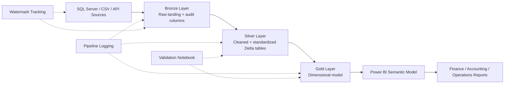

# Architecture Diagram

Paste this Mermaid diagram into GitHub Markdown or a Mermaid renderer.

```mermaid
flowchart LR
    A[SQL Server / CSV / API Sources] --> B[Bronze Layer<br/>Raw landing + audit columns]
    B --> C[Silver Layer<br/>Cleaned + standardized Delta tables]
    C --> D[Gold Layer<br/>Dimensional model]
    D --> E[Power BI Semantic Model]
    E --> F[Finance / Accounting / Operations Reports]

    G[Pipeline Logging] -.-> B
    G -.-> C
    G -.-> D

    H[Watermark Tracking] -.-> A
    H -.-> B

    I[Validation Notebook] -.-> C
    I -.-> D
```
